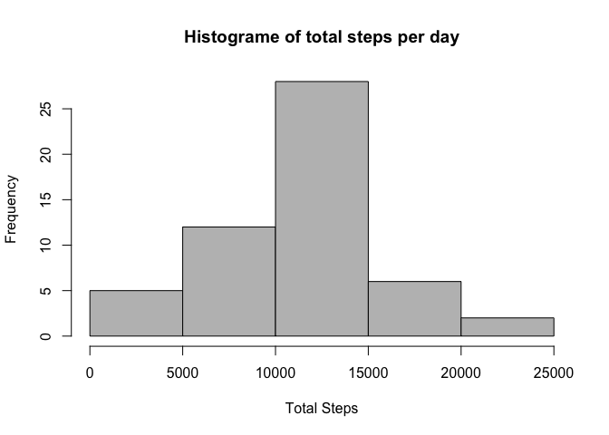
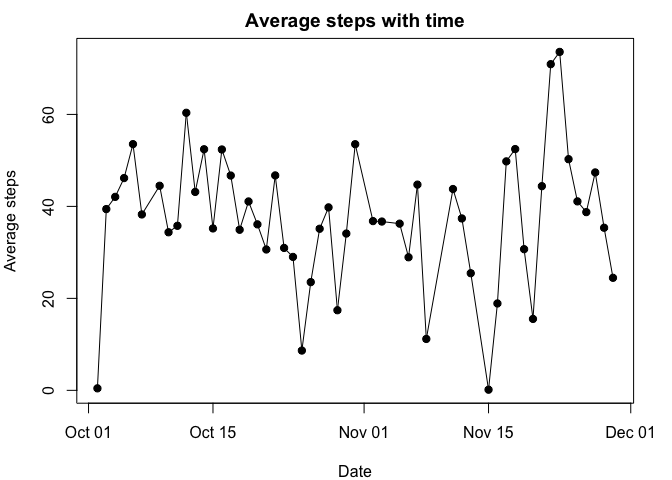
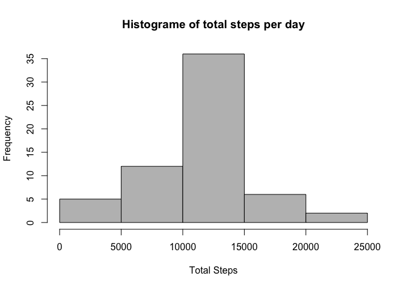
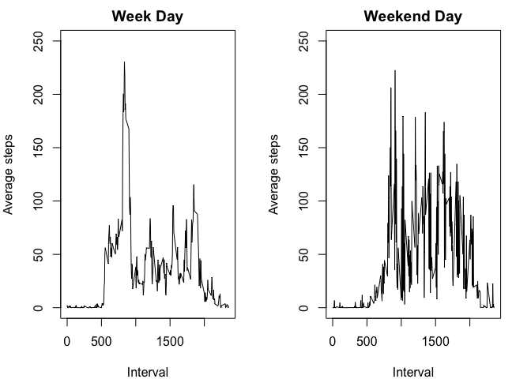

The raw data is collected by a personal activity monitoring device. This
device collects data at 5 minute intervals through out the day. The data
consists of two months of data from an anonymous individual collected
during the months of Octorber and November,2012 and include the number
of steps taken in t minute intervals each day.

Step1: Read the data

    rawdata<-read.csv(unz("activity.zip","activity.csv"), sep=",")

Step2: histogram showing the total number of steps taken each day

    sumsteps<-aggregate(steps~date,data=rawdata,sum,na.action=na.omit)
    hist(sumsteps[,2],main="Histograme of total steps per day",xlab="Total Steps",col="grey")

  

    dev.copy(png,width=480,height=480,filename="Histograme of total steps per day.png")
    dev.off()

Step3: Mean and median number of steps taken each day

    meansteps<-aggregate(steps~date,data=rawdata,mean,na.action=na.omit)
    mediansteps<-aggregate(steps~date,data=rawdata,median,na.action=na.omit)
    head(meansteps)

    ##         date    steps
    ## 1 2012-10-02  0.43750
    ## 2 2012-10-03 39.41667
    ## 3 2012-10-04 42.06944
    ## 4 2012-10-05 46.15972
    ## 5 2012-10-06 53.54167
    ## 6 2012-10-07 38.24653

    head(mediansteps)

    ##         date steps
    ## 1 2012-10-02     0
    ## 2 2012-10-03     0
    ## 3 2012-10-04     0
    ## 4 2012-10-05     0
    ## 5 2012-10-06     0
    ## 6 2012-10-07     0

    range(meansteps$steps)

    ## [1]  0.1423611 73.5902778

Step4: Plot time series plot of the average number of steps taken

    par(mfrow=c(1,1), mar=c(4,4,2,2))
    meansteps$date<-as.Date(meansteps$date)
    plot(meansteps,type="o",pch=19,main="Average steps with time",xlab="Date",ylab="Average steps")

  

    dev.copy(png,width=480,height=480,filename="Time series plot of average number of steps taken.png")
    dev.off()

Stpe5:Find out the 5-minute interval that, on average,contains the
maximum number of steps

    library(dplyr)
    meansteps_interval<-aggregate(steps~interval,data=rawdata,mean,na.action=na.omit)
    meansteps_interval<-arrange(meansteps_interval,steps)
    max<-meansteps_interval[length(meansteps_interval$steps),]
    max

    ##     interval    steps
    ## 288      835 206.1698

Step6:clean the data by substituting "NA"" by the mean of their
corresponding interval

    library(reshape2)
    rawdata_t<-melt(rawdata,id=c("interval","date"),na.rm=TRUE)
    mean_interval<-dcast(rawdata_t,variable~interval,mean)
    mean_interval<-melt(mean_interval,variable.name="interval",value.name="steps")

    ## Using variable as id variables

    cleandata<-merge(rawdata,mean_interval[,-1],by="interval",all=TRUE,sort=TRUE)
    cleandata$steps.x[is.na(cleandata$steps.x)]<-cleandata$steps.y[is.na(cleandata$steps.x)]
    cleandata<-arrange(cleandata[,-4],date,interval,steps.x)
    cleandata<-cleandata[,c(3,1,2)]

Step7: Plot Histograme of the total number of steps taken each day after
missing values are imputed

    tsteps<-dcast(melt(cleandata,id=c("interval","date")),variable~date,sum)
    tsteps<-melt(tsteps,variable.name="date",value.name="total_steps")

    ## Using variable as id variables

    hist(tsteps$total_steps,main="Histograme of total steps per day",xlab="Total Steps",col="grey")

  

    dev.copy(png,width=480,height=480,filename="Histograme of total steps per day_clean data.png")
    dev.off()

Step8: Panel plot comparing the average number of steps taken per
5-minute interval across weekdays and weekends

    library(lubridate)
    cleandata<-mutate(cleandata,week=weekdays(ymd(date)))
    weekend_data<-cleandata[cleandata$week==c("Saturday","Sunday"),]
    weekday_data<-cleandata[cleandata$week!=c("Saturday"),]
    weekday_data<-weekday_data[weekday_data$week!=c("Sunday"),]
    asteps_weekday<-aggregate(steps.x~interval,data=weekday_data,mean)
    asteps_weekend<-aggregate(steps.x~interval,data=weekend_data,mean)
    par(mfrow=c(1,2),mar=c(4,4,2,2))
    plot(asteps_weekday,type="l",main="Week Day",xlab="Interval",ylab="Average steps",ylim=c(0,250))
    plot(asteps_weekend,type="l",main="Weekend Day",xlab="Interval",ylab="Average steps",ylim=c(0,250))

  

    dev.copy(png,width=480,height=480,filename="Comparing weekdays and weekends.png")
    dev.off()

Summary of the data:

1.  Most frequently, the anonymous volunteer takes 1000-1500 steps per
    day

2.  Avarage steps taken by the volunteer at 5 minutes interval per day
    range from 0.14 to 73.6

3.  The maximan steps taken by the volunteer is 206 at the 835th 5
    minutes interval

4.  After imputing "NA" with the mean steps of its corresponding
    interval, the data still shows the volunteer most frequently takes
    1000-1500 steps per day

5.  Comparing the weekdays and weedends, the volunteer takes more steps
    in weekends. The steps were taken at 500th to 2000th 5 minutes
    interval.
